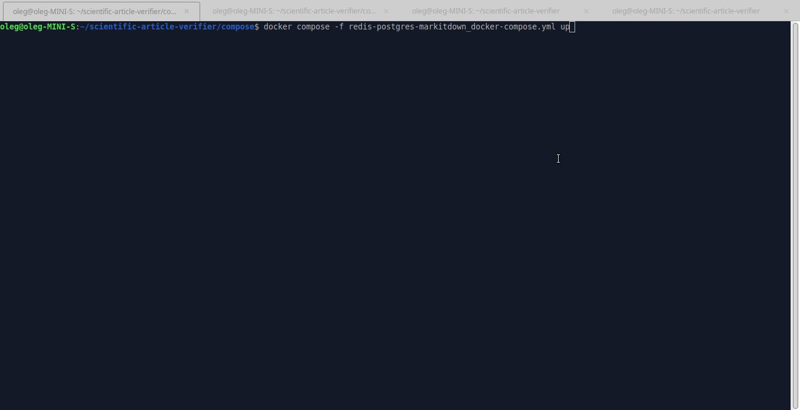
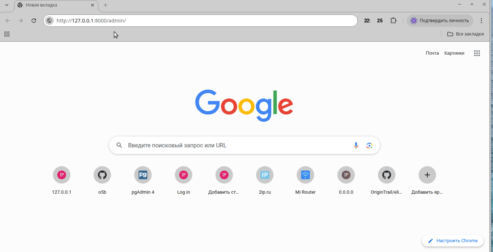
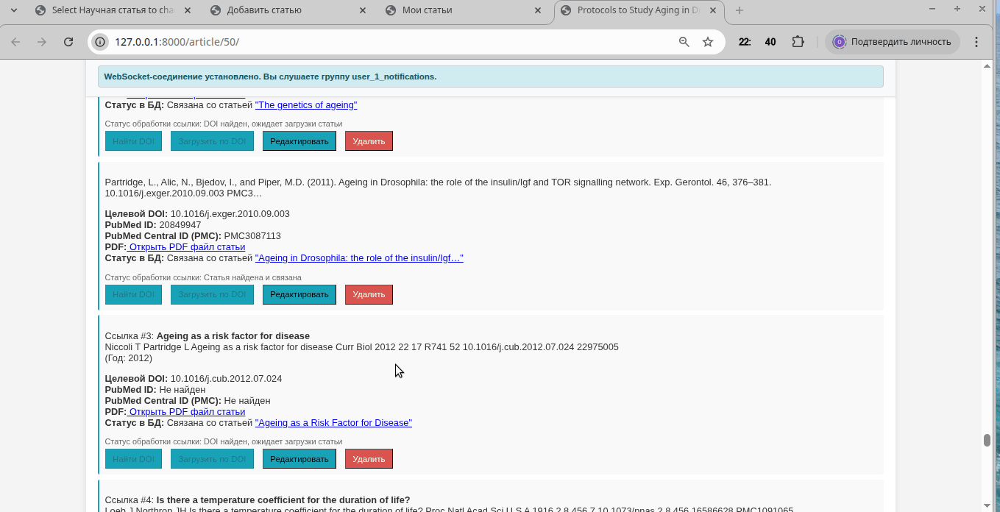
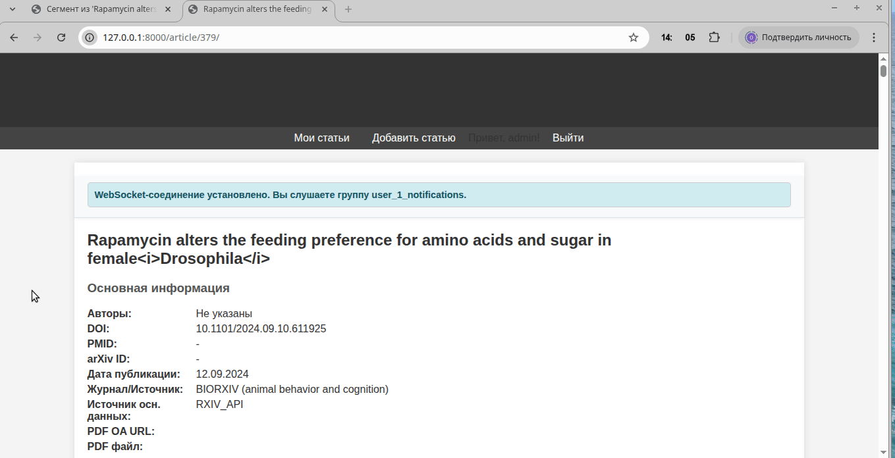
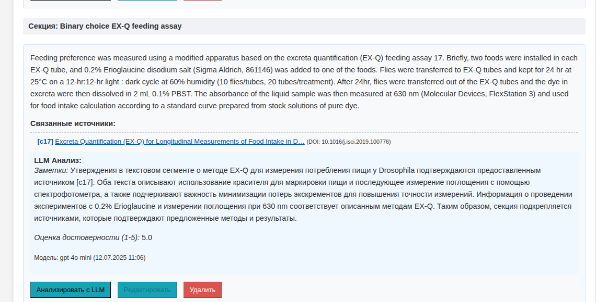
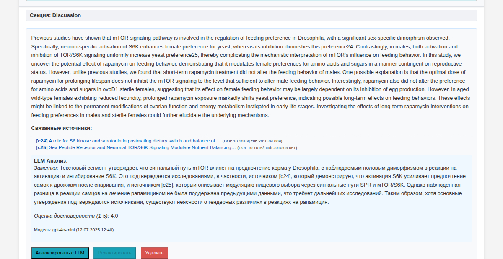

# En: Scientific Article Quality Verification Application

Based on `Python3.12` and `Ubuntu 24.04.2 LTS`

This application automates the verification of scientific article truthfulness by analyzing the cited materials it references.

In the web interface, you enter the `DOI` of the article to be verified, which is then used to search for data (metadata, full article text in XML format, article PDF file) across various scientific resources (crossref, pubmed, biorxiv, etc.).

From the obtained structured version of the article, text is extracted and divided into analyzable segments (currently paragraphs), and citation references are extracted and linked to the corresponding segment.

For each extracted reference, its `DOI` is searched (api.crossref.org) and then available information (metadata, article text, PDF files) is searched using the found `DOI`. The obtained data from XML and PDF formats is converted to text for further processing in LLM.

If it's necessary to evaluate any article segment, its text along with the text of related articles is sent as a prompt to the LLM with instructions to verify whether the segment is confirmed and evaluate it on a 5-point scale.

Such verification can facilitate researchers' work with scientific articles. As one use case, based on verified articles, AI agents will be able to generate higher quality scientific hypotheses.

## Installation

To install, execute the following commands in the console:

```bash
git clone https://github.com/o5b/scientific-article-verifier.git
cd scientific-article-verifier
python3.12 -m venv venv
source venv/bin/activate
pip install -r requirements/base.txt
```

After installing Python packages, you need to install Chromium-Driver for `patchright`. To do this, execute the following command in the console:

```bash
cd scientific-article-verifier
source venv/bin/activate
patchright install chromium
```

## Preparation for Launch

### Starting Required Docker Containers

The application uses various components (databases: Redis, PostgreSQL, markitdown - for converting PDF to text) running in Docker. Therefore, before starting, docker-compose must be installed and configured in the system.

To start Docker containers, execute the following commands in the console:

```bash
cd scientific-article-verifier/compose/
docker compose -f redis-postgres-markitdown_docker-compose.yml up
```

During the first run, `docker compose` will build containers, which can take a long time. Subsequent runs will be faster.

#### Some Useful Docker Commands

```bash
# To display containers:
docker ps -a
# To display images:
docker images -a
# To stop containers related to docker compose file:
cd scientific-article-verifier/compose/
docker compose -f redis-postgres-markitdown_docker-compose.yml down
# To remove all stopped containers and unused images from the system:
docker system prune -a
```

### Preparing Django Before First Launch

Navigate to the project folder and activate the virtual environment if you haven't already:

```bash
cd scientific-article-verifier
source venv/bin/activate
```

Create your own secret file:

```bash
cp env.example .env
```

Fill it with your data if needed:

```bash
# SECRET_OPENAI_API_KEY = '' # your-openai-key
# SECRET_NCBI_API_KEY = '' # your-pubmed-key
SECRET_APP_EMAIL = 'your-email'
DJANGO_SECRET_KEY = 'your-django-secret'
```

`SECRET_NCBI_API_KEY` - key for accessing PubMed API, if available.

`SECRET_APP_EMAIL` - email sent during data requests from various resources. Without it, third-party services may limit the number of requests.

`SECRET_OPENAI_API_KEY` - your key for accessing OpenAI API. If the key is missing, there will be an attempt to send a request to `Grok` (you can also explicitly specify `Grok` in the `settings.py` file in the `LLM_PROVIDER_FOR_ANALYSIS = 'Grok'` setting), but this option is extremely unstable due to `cloudflare.com` checks.

Run Django migrations (`redis-postgres-markitdown_docker-compose.yml` should already be running):

```bash
python manage.py migrate
```

Create a superuser:

```bash
python manage.py createsuperuser
```

When prompted, enter an admin name, any email, and your password:

```bash
Username (leave blank to use 'oleg'): admin
Email address: admin@example.com
Password:
Password (again):
Superuser created successfully.
```

## Running the Application

Navigate to the project folder and activate the virtual environment if you haven't already:

```bash
cd scientific-article-verifier
source venv/bin/activate
```

For local development, to avoid problems with `CSS` style display on the page, you can use the `django` server:

```bash
python manage.py runserver
```

In production, it's better to use the `daphne` server for launch:

```bash
daphne settings.asgi:application
```

In another console, start Celery.
If needed, activate the virtual environment and start `Celery`:

```bash
cd scientific-article-verifier
source venv/bin/activate
celery -A settings worker -l info
```



At `http://127.0.0.1:8000/admin/` you can log into the site admin panel.

In the browser at `http://127.0.0.1:8000/` the application will be launched, where you can enter the `DOI` of the analyzed article and start the process of searching and downloading data from the network.



After a few minutes, the application will complete collecting available data from the network.


In the user web interface, you can edit or try to download unavailable data.



In case of successful data retrieval, you can perform truthfulness verification of a specific text segment from the article using LLM.



LLM Response:



Another example of LLM query:


LLM Response:


